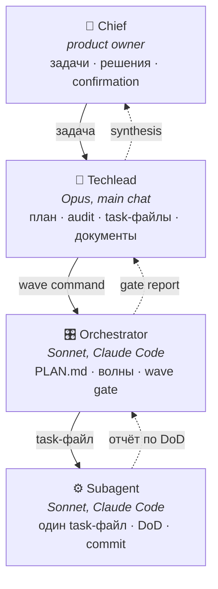
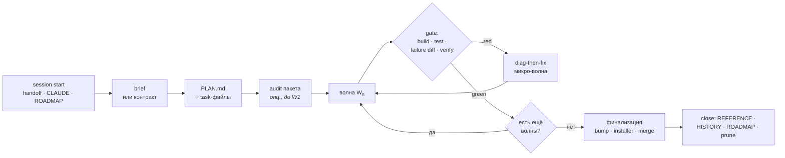

<div align="center">

# Claude Workflow Template

**Процессный каркас для проектов, где код пишет Claude, а не человек.**

Четыре уровня ответственности · волновое выполнение · task-файлы под субагентов · gate'ы и verify по диску

</div>

---

## Зачем это

Когда код пишут агенты, узкое место — не генерация, а **дисциплина процесса**. Типичные боли:

| Проблема | Что даёт шаблон |
|---|---|
| Агент угадывает сигнатуры и ломает сборку | Инвариант «read реального кода перед task-файлом» |
| Два субагента параллельно правят один файл → git race | File isolation в волне + audit перед стартом |
| «Готово» означает «код написан», а не «тест зелёный» | DoD = конкретная команда с machine-readable выводом |
| Контекст теряется между чатами, следующая сессия начинает с нуля | Handoff-контракт: снимок состояния в одном JSON |
| Фикс чинит не ту причину | Diag-then-fix: диагностика и правка — разные фазы |
| Ревью одним взглядом пропускает дефекты | Multi-role audit с triangulation rule |

Шаблон **stack-agnostic**: правила про процесс, не про язык. Единственный файл с калькой под конкретный стек — [`docs/09-runtime-cookbook.md`](docs/09-runtime-cookbook.md).

---

## Четыре уровня



Границы жёсткие и намеренные:

- **Subagent** не принимает архитектурных решений — только выполняет инструкцию.
- **Orchestrator** не принимает архитектурных решений — только `PLAN.md → волна → confirm → следующая`.
- **Techlead** не принимает product-решений без подтверждения Chief'а.
- **Chief** — единственный источник product direction.

Ambiguity эскалируется вверх: `Subagent → Orchestrator → Techlead → Chief`. Не угадывать.

---

## Девять базовых правил

1. **File isolation в волне.** Два субагента не трогают один файл — даже разные функции в нём.
2. **DoD = passing test**, не «код написан». Команда + ожидаемый вывод, проверяемые третьим лицом.
3. **Confirmation loops** между волнами и перед merge — обязательны.
4. **Никаких phantom-сигнатур.** Перед task-файлом — чтение реального кода, не память.
5. **Verify по диску** для критичного: метрики из лога, а не из рапорта; git refs, а не «смержил».
6. **Automated smoke закрывает gate, manual visual smoke обязателен в UI-волне** — автотест не видит пустую панель.
7. **Перенос состояния — через handoff-контракт**, не через надежду на память сессии.
8. **Task-файлы пишутся под одну модель-executor** и не переключаются внутри эпика.
9. **Версия — lockstep** по всем источникам одновременно.

---

## Быстрый старт

```bash
git clone <this-repo> my-project-workflow
cp -r my-project-workflow/.claude my-project-workflow/docs  <путь-твоего-проекта>/
```

Дальше по шагам:

1. **`.claude/CLAUDE.md`** — заполнить `<PROJECT>` / `<CHIEF>` / `<PROJECT_PATH>`, платформы, стек, build-скрипты, project-specific инварианты.
2. **`.claude/templates/handoff.json`** → скопировать в `.claude/<handoff>.json`, заполнить `identity` / `project_state`, убрать `_hint`.
3. **`docs/09-runtime-cookbook.md`** — заполнить под свой стек: сборка, E2E, стенд, testid, анти-паттерны рантайма.
4. **`.claude/ROADMAP.md`** — первый эпик, baseline-метрики, дата.
5. Завести пустые **`REFERENCE.md`** (накопительные lessons) и **`archive/HISTORY.md`**.
6. В `.gitignore` добавить `.claude/tmp/` и `.audits/**/*.log`.

Hint-блоки в шаблонах удаляются после первого заполнения.

---

## Что внутри

```
.claude/
├── CLAUDE.md          # тонкий operational: идентификация, роли, инварианты
├── ROADMAP.md         # состояние проекта + очередь эпиков + закрытые
├── WORKFLOW.md        # процессы §0–§25, на которые ссылаются task-файлы
└── templates/         # копи-правь заготовки
    ├── task-file.md
    ├── orchestrator-wave-command.md
    ├── PLAN.md
    ├── fitch-contract.json
    ├── audit-report.md
    └── handoff.json
docs/                  # учебники: примеры good/bad + обоснование
```

**Разделение ответственности:** `WORKFLOW.md` — императивные правила («делай так»), `docs/` — почему именно так и как выглядит хорошо/плохо. `CLAUDE.md` не хранит lessons, `REFERENCE.md` не хранит процессы, `WORKFLOW.md` не хранит состояние. Каждый факт живёт в одном месте.

---

## Карта документов

| # | Документ | О чём |
|---|---|---|
| 01 | [Roles and Communication](docs/01-roles-and-comms.md) | Кто кому что пишет и в каком тоне, эскалация |
| 02 | [Epic Lifecycle](docs/02-epic-lifecycle.md) | Полный цикл от идеи до архива, чек-листы |
| 03 | [Task Files Anatomy](docs/03-task-files-anatomy.md) | Как писать task-файл под субагента, анти-паттерны |
| 04 | [Audits Triada](docs/04-audits-triada.md) | Multi-role audit, triangulation rule, scope sizing |
| 05 | [Diag-then-Fix](docs/05-diag-then-fix.md) | Паттерн для багов, где первичный диагноз ненадёжен |
| 06 | [File Isolation](docs/06-file-isolation.md) | Главный инвариант параллельных волн, ownership |
| 07 | [Skills Overview](docs/07-skills-overview.md) | Референсный набор ролей-скиллов и их композиция |
| 08 | [Housekeeping & Pre-flight](docs/08-housekeeping-and-pre-flight.md) | Cleanup-эпики, prune артефактов, готовность к старту |
| 09 | [Runtime Cookbook](docs/09-runtime-cookbook.md) | Слот под твой стек — единственный не-generic файл |

Плюс [`.claude/WORKFLOW.md`](.claude/WORKFLOW.md) — операционная инструкция с § нумерацией, источник истины по процессу.

---

## Жизненный цикл эпика



Каждая стрелка между волнами — подтверждение от Chief'а. Без него следующая волна не стартует.

---

## Что шаблон НЕ покрывает

- **Конкретный стек** — паттерны stack-agnostic, конкретика в `09-runtime-cookbook.md`.
- **Тестовые фреймворки** — DoD пишется на любом.
- **CI/CD pipeline** — инфраструктурный вопрос, не workflow.
- **Регуляторные требования** — product-вопрос, не workflow.
- **Сами скиллы** — в репозиторий не входят; `docs/07` описывает, какие роли нужны, чтобы завести свои.

---

## Лицензия

[MIT](LICENSE) — бери, режь под себя, ничего не спрашивай.
