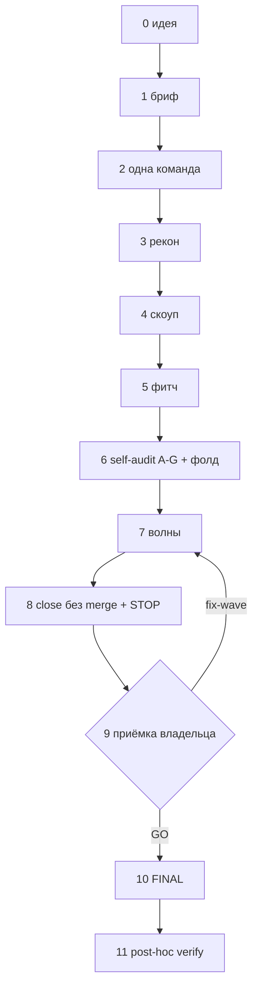

# 02 — Автономный цикл эпика: пошаговый разбор

Канон — [PIPELINE.md](../.claude/PIPELINE.md); здесь тот же цикл шаг за шагом, с типичным провалом на
каждом шаге. Читать вместе с [01-roles-and-comms.md](./01-roles-and-comms.md) (кто есть кто) и
[10-gates-and-evidence.md](./10-gates-and-evidence.md) (как заявление становится фактом).

## Схема

## Шаг 0 — Идея

Три источника: задача от владельца (конкретная или абстрактная); находки аудита/self-audit прошлого
эпика, созревшие в отдельный эпик; пункт из накопленного пула отложенного на подхват. Для первого и
третьего источника техлид готовит бриф (Шаг 1); для второго — сами находки уже дают план.

## Шаг 1 — Бриф

Техлид и владелец формулируют бриф ДО старта цикла ([PIPELINE.md §2](../.claude/PIPELINE.md#2-бриф)).
Обязательные элементы: решения владельца, проблема/цель, scope + явный out-of-scope, оси рекона,
seed-якоря с пометкой «re-grep обязателен», неприкосновенные инварианты, правило выбора объёма,
HALT-меню, критерии успеха числом, план верификации техлида на post-hoc, режим (lean/full).

**Хороший бриф** даёт числа и конкретные якоря: «домен X содержит N единиц, семь уже используют
паттерн Y (file:line)». **Плохой бриф** («сделай наши настройки строже») не даёт оркестратору
критерия остановки — эпик либо не заканчивается, либо заканчивается не тем, что имел в виду владелец.

Seed-якоря техлида — предположение, не факт: помечены «re-grep обязателен», и рекон (Шаг 3) обязан
перепроверить каждый с нуля, а не принять на слово.

**Типичный провал:** бриф без чисел → оркестратор придумывает критерий сам → через несколько волн
выясняется, что придуманный критерий не совпадает с тем, что представлял владелец.

## Шаг 2 — Одна команда

Техлид отправляет оркестратору одну команду на запуск всего цикла. Дальше нет промежуточных
чат-гейтов между рекон/скоуп/фитч/self-audit/кодинг/close — это один непрерывный автономный прогон,
не серия отдельных команд на каждый шаг.

## Шаг 3 — Рекон

Оркестратор поднимает рой независимых Sonnet-субагентов по осям брифа. Triangulation: 3+ независимых
субагента согласны — твёрдая находка; отдельный субагент обязан попытаться ОПРОВЕРГНУТЬ любое
утверждение об отсутствии («фичи X нет», «дефект не найден») — один grep не доказывает отсутствие.
Рекон **не правит найденное** — только карта и вердикты; правка — работа кодинга (Шаг 7). Артефакт —
фактура на диске в каталоге эпика. Владельцу уходят только вопросы из фактуры, не сам документ.

**Типичный провал:** «рекон заодно починил» — рекон, который вместо карты правит найденное, теряет
трассируемость: непонятно, что было измерено, а что уже изменено в процессе измерения.

## Шаг 4 — Скоуп

Оркестратор сам выбирает объём эпика по правилу из брифа (обязательный минимум + вместимость + куда
уходит остаток). Что не влезает — явная запись в фактуре для следующего эпика, не «раз уж мы тут» в
текущий.

## Шаг 5 — Фитч

Оркестратор строит контракт с пятью ролями (analyst/designer/tech_lead/toster/devops) — каждая либо
заполняет свою секцию, либо честно помечена `not_applicable` с причиной. Контракт пишется inline:
сигнатуры и волновые гейты — ДО self-audit, чтобы аудит проверял осуществимость, а не абстрактный
план. Артефакт — контракт + план + task-файлы (каждый с сигнатурой и DoD).

## Шаг 6 — Self-audit A–G и фолд

Свежий adversarial-субагент без памяти о брифе/контракте — иначе унаследует слепые пятна автора.
Семь направлений: покрытие требований, осуществимость сигнатур против реального кода, изоляция
файлов по волнам, корректность волновой разбивки, охота на ложно-зелёные DoD-грепы, неприкосновенные
инварианты, упущенные грани (включая дефекты, которые вносит сам план). HIGH — блокер старта волн, с
`file:line` и конкретной правкой. Фолд — правка контракта/task-файлов ДО первой волны, полной
перезаписью файла (частичная построчная правка ломает структуру), без похода к владельцу.

**Типичный провал:** self-audit по памяти о плане, без реального grep по коду — пропускает ровно тот
класс дефектов (несуществующая сигнатура, устаревшая строка-якорь), ради которого он и существует.

## Шаг 7 — Волны

W0→final автономно, без чат-стопов между волнами и микрошагами. Машинный DoD (grep / зелёный тест) —
самостоп: волна останавливает сама себя, когда гейт зелёный, оркестратор раздаёт следующую. Вердикт
по результатам волны выносит отдельный post-wave verify субагент, не самоотчёт исполнителя. Сложные
красные — сначала диагноз, потом фикс; не более двух попыток самолечения на гейт, третий красный
уходит в HALT. HALT — только по фиксированному меню из брифа, других остановок внутри кодинга нет.

**Типичный провал:** возврат к подтверждению между волнами «раз гейт зелёный» — регрессия волны N+1
смешивается с недочинкой волны N, диагностика задним числом становится невозможной (ради этого
подтверждение и заменено машинным DoD).

## Шаг 8 — Close без merge + STOP-отчёт

Оркестратор сам, без техлида: обновляет changelog, поднимает версию в lockstep по всем источникам,
собирает артефакт с контрольной суммой, прогоняет полный регрессионный набор (узкий набор на волнах
— нормально, полный на close — обязателен), пишет короткий чек-лист ручного смока, складывает пикапы
эпика в единый раздел, архивирует рабочие файлы, чистит временные артефакты. **Merge, тег и push на
этом шаге НЕ выполняются** — они в Шаге 10, сразу по GO владельца. Формат отчёта —
[10-gates-and-evidence.md §5](./10-gates-and-evidence.md#5-формат-отчёта-владельцу-канон).

## Шаг 9 — Приёмка владельца

Единственная плановая внешняя остановка цикла. Владелец проверяет собранный и установленный
артефакт (не переключением рабочего дерева, не запуском из исходников) по короткому чек-листу —
[11-acceptance-and-final.md §1-2](./11-acceptance-and-final.md).

## Шаг 10 — FINAL по GO

GO владельца заменяет отдельную команду на запуск — оркестратор сразу выполняет merge --no-ff, тег
на коммите заморозки, push, обновление реестров, переиндексацию базы знаний, архивирование, чистку
диска — [11-acceptance-and-final.md §5](./11-acceptance-and-final.md#5-механика-final).

## Шаг 11 — Post-hoc verify техлида

Техлид не берёт «готово»/«зелёно» на слово — перепроверяет по диску: тег указывает на реальный
merge-коммит, версии согласованы по всем источникам, артефакт собран позже кода, числа гейтов
воспроизводимы тем же парсером, дерево чистое. Расхождение любого пункта — HALT обратно
оркестратору, не тихая ручная правка техлидом — таблица целиком:
[11-acceptance-and-final.md §6](./11-acceptance-and-final.md#6-post-hoc-verify-техлида).

## Длительность — ориентиры

Цикл — один прогон, не серия сессий с ожиданием подтверждения между волнами; длительность в основном
определяется размером эпика, а не числом чат-итераций — их больше нет между внутренними шагами:

| Класс эпика | Задач | Фитч | Порядок величины |
|---|---|---|---|
| Hotfix | 1–2 | без фитча | часы |
| Small | 5–10 | lite | до дня |
| Medium | 15–30 | full + self-audit | несколько дней |
| Large | 40–60 | full + self-audit, возможен fix-pass | полторы-две недели |

## Антипаттерны

1. **Бриф без чисел** — «сделай лучше» вместо измеримого критерия; см. Шаг 1.
2. **«Рекон заодно починил»** — теряет трассируемость между картой и правкой; см. Шаг 3.
3. **Возврат к подтверждению между волнами** — распад диагностики регрессий; см. Шаг 7.
4. **Merge до GO владельца** — единственная плановая остановка цикла пропущена.
5. **Реестры/архив эпика оставлены «на потом»** — следующая сессия без общей памяти читает диск и
   находит эпик наполовину закрытым; close — это состояние мира на диске, не только код.
6. **Отчёт честно неполон** («сделано 15 из заявленных 21, остальное отложено», но changelog пишет
   «21») — расхождение между деревом и словом отдельный класс находки, не оговорка.

## Чек-лист перед командой на запуск

- [ ] Бриф одобрен владельцем, HALT-меню зафиксировано.
- [ ] Оси рекона и seed-якоря помечены «re-grep обязателен».
- [ ] Неприкосновенные инварианты перечислены явно.
- [ ] Правило выбора scope (минимум/вместимость/остаток) есть в брифе.
- [ ] План верификации техлида на post-hoc записан заранее, не придумывается после факта.
