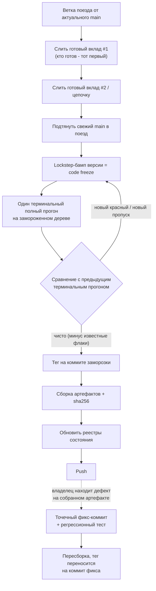

# 13 — Поезда слияния и параллельные линии

## Зачем нужен поезд

Несколько независимо готовых цепочек/PR (иногда от разных участников или параллельных линий,
работающих одновременно) оказываются готовы примерно в одно время. Вместо того чтобы сливать и
версионировать каждый вклад отдельно, их объединяют в один «поезд»: продукт платит цену бампа
версии, полного регрессионного прогона и релизной сборки один раз на партию, а не N раз.

## Схема поезда

Версия под тегом не меняется повторно на шаге L/M — под ней ещё ничего не было отгружено вовне.

## Механика поезда

- **Ветка поезда.** Выделенная интеграционная ветка; каждый готовый вклад сливается по очереди,
  порядок — «кто готов — тот первый» (см. ниже); точки коллизии разрешаются только аддитивно,
  никогда переписыванием чужой работы. Специальная проверка проходит по каждой строке, удалённой
  при разрешении конфликта слияния, и требует, чтобы она была либо явно безопасным
  форматированием/комментарием, либо явно обоснованным намеренным удалением — тихая потеря
  строки любой из сторон — отдельный класс дефекта.
- **Слияние main в поезд.** До или во время сборки поезда в него подтягивается свежая общая
  линия, чтобы итог не строился на устаревшей базе.
- **Lockstep-бамп версии = заморозка кода.** Один коммит одновременно поднимает версию во ВСЕХ
  файлах-источниках версии продукта (их несколько, и им нельзя разъезжаться) плюс заголовки
  changelog. После этого коммита ничего в продукте не меняется, кроме фиксов дефектов, найденных
  проверкой самой этой заморозки.
- **Один терминальный полный прогон.** Ровно один полный прогон всего автоматического
  регрессионного набора — именно на замороженном коммите, никогда на промежуточном состоянии
  слияния; именно его вывод становится цитируемым числом.
- **Сравнение с предыдущим терминалом.** Автоматически генерируется сравнение с непосредственно
  предыдущим полным прогоном по категориям: новый красный (не должен существовать), новый
  пропуск, новый зелёный там, где было красным, ранее-красный-теперь-починенный. Поезд не
  считается чистым, пока категории «новый красный» и «новый пропуск» не пусты — за вычетом
  заранее явно задекларированных известных нестабильных случаев.
- **Тег.** Аннотированный тег ставится на точный коммит заморозки, как только прогон чист.
- **Инсталляторы + контрольные суммы.** Релизные артефакты собираются именно из замороженного
  дерева, только одобренными точками входа сборки; для каждого артефакта фиксируется
  криптографическая контрольная сумма вместе с размером сборки (часто сравнивается с предыдущим
  релизом — чтобы крупная дельта размера имела названную причину).
- **Реестры.** В том же close-проходе обновляется небольшое число документов «текущего состояния
  мира» — версии, что изменилось, что нужно перезапустить, живой список отложенных задач — чтобы
  следующая сессия без памяти об этой восстановила состояние только по диску.
- **Push.** Только после всего перечисленного история ветки отправляется в общий репозиторий. Вся
  последовательность слияние/тег/заморозка/прогон/сборка до этого момента идёт в локальной, ещё
  не отправленной ветке — чтобы дефект, найденный в любой момент до push, можно было дёшево
  откатить.
- **Находка владельца на финале.** Процесс явно допускает, что владелец, устанавливая только что
  собранный артефакт, найдёт то, что пропустила автоматическая приёмка (см. «приёмка проходит
  путь пользователя», [11-acceptance-and-final.md](./11-acceptance-and-final.md)). Тогда поверх
  заморозки добавляется небольшой строго ограниченный коммит-фикс вместе с регрессионным тестом
  (красный на старой сборке, зелёный на новой), делается новая сборка, тег переносится на
  исправленный коммит — сам номер версии не меняется повторно.

## Бриф поезда: повторяющиеся разделы

Бриф поезда — короткий версионированный плановый документ, который лид пишет один раз перед
началом партии сцепленных работ; каждая цепочка подмешивает его в собственный chain-brief.
Шаблон — `kit/templates/train-brief.md`. Повторяющиеся разделы (T-пункты):

| Раздел | Содержание |
|---|---|
| Предусловия | машинно проверяемый гейт: предыдущий релиз выпущен и помечен тегом локально и на удалённом, рабочее дерево чисто, инструменты оператора перезапущены достаточно недавно, чтобы видеть изменения предыдущего поезда — невыполнение немедленно останавливает прогон одной строкой |
| Контур и распределение моделей | кто оркестратор, кто делегат, на какой модели/варианте, с каким предохранителем включённым по умолчанию (процессом управляет строго одна вещь одновременно) |
| Роль модератора | только лид выполняет механически рискованные шаги (регресс-прогоны, деплой окружений, операции с историей репозитория) — делегат никогда |
| Резервации нумерации/порядка | какие идентификаторы (номера фич/задач, номера тестов, ключи тестового окружения) предстоящим цепочкам разрешено занять — проверяется свежим поиском, а не предполагается; правило отката: если занято — берём следующий свободный, фиксируем строкой |
| Кумулятивный чек-лист уроков | каждый пункт — конкретный провал предыдущего прогона, переформулированный как императивное правило и почти дословно перенесённый в следующий chain-brief |
| Известные дефекты инструментария | и как модератор их компенсирует до фикса |
| Пункты приёмки | какой пакет делегат обязан сдать лиду: каждый гейт перегнан заново со стенограммой, каждый заявленный артефакт независимо проверен, конкретная измерительная таблица, проверка влияния на потребителей для любого изменения с внешними вызывающими сторонами |
| Части финала | двухчастная форма: часть первая — всё, что лид может безопасно сделать без риска внешней связности (слияние, тег, база знаний, реестры) — БЕЗ push; часть вторая — только после перезапуска клиента/инструментов оператора и чистой живой проверки здоровья, только тогда push; красная живая проверка после части первой останавливает процесс до push |
| Явные команды | короткий раздел, буквально цитирующий, что говорит оператор для запуска каждого этапа — чтобы лид не гадал о границах полномочий |

## Контракт параллельных линий

Когда две линии разработки (например, два участника, либо человеческая линия и линия внешнего
контура) растут из одной кодовой базы одновременно, единый контрактный документ закрепляет
собственное пространство имён за каждой линией ещё до того, как обе тронут общие файлы. Канон —
`kit/PARALLEL-LINES.md`.

- **Резервации.** Диапазон идентификаторов фич/задач; диапазон номеров файлов автотестов;
  уникальный короткий строковый префикс для тестовых хуков; уникальный префикс имён для новых
  низкоуровневых команд.
- **Одна зафиксированная ловушка.** Префикс, который выглядит свободным, может уже незаметно
  использоваться не связанной с этим предсуществующей возможностью под тем же коротким именем —
  задокументировать один раз, как только обнаружено, чтобы та же коллизия не открылась заново
  другой линией.
- **Швы только аддитивны.** Каждое место, которое обе линии структурно гарантированно затронут
  (обычно горстка центральных диспетчерских таблиц/перечислений/switch-веток) — подчиняется
  правилу «только добавлять новую ветку/case в конец, никогда не редактировать существующую
  ветку другой стороны». Линия, которая доходит до точки интеграции второй, сама разрешает
  конфликт на своей стороне выделенной проверкой, проходящей по каждой удалённой слиянием строке
  и требующей, чтобы каждая была либо доказуемо безвредным переформатированием той же стороны,
  либо явно обоснована.
  - Две функции, вставленные в одном шве, могут быть перемешаны текстовым слиянием — надёжное
    разрешение: реплеить хунки каждой стороны поверх общей базы слияния (base-coordinate merge),
    затем свериться с удалёнными строками против каждой стороны отдельно.
- **Зоны, которые нельзя трогать.** Бинарные/непрозрачные файлы состояния (не сливаются вовсе);
  версионно-идентифицирующие файлы; общий базовый/реестровый файл (можно только расширять
  собственный записанный блок, никогда не редактировать блок другой линии); каждый файл
  changelog в репозитории (только собственная секция).
- **Известное общее ограничение — не чинить ни с одной стороны.** Обе линии иногда делят
  предсуществующий архитектурный пробел, который любая могла бы правдоподобно «полезно» закрыть,
  но это гарантированно даст конфликт слияния ровно в точке, где обе стороны и так вынуждены
  столкнуться. Контракт явно запрещает трогать его по случаю — он откладывается на собственную
  будущую выделенную единицу работы.
- **Каденция ребейза.** Обе линии периодически перебазируют работу на свежий общий main (именно
  rebase, а не merge — цель воспроизвести свои коммиты поверх свежей базы, а не переплетать
  истории), а не сливают main в себя.
- **«Кто готов — тот первый».** Когда приходит время интегрироваться, линия, готовая первой,
  сливается первой; вторая перебазируется на новое общее состояние и сама платит цену разрешения
  конфликта шва на своей стороне — это намеренная структура стимулов, а не случайность.

## Чек-лист шовного PR

- [ ] Ключ конфигурации шва меняется «всё или ничего» одним коммитом, не частями.
- [ ] Паритет с раннером/донорской фичей проверен по вызову, а не по текстовому совпадению.
- [ ] Аудит удалённых строк выполнен против КАЖДОЙ стороны шва, не только против своей.
- [ ] Префикс тестовых хуков/команд не сталкивается ни с чужой линией, ни с предсуществующей
  возможностью.
- [ ] Реестр/базовый файл расширен только в собственном блоке.

## Анти-паттерны

1. **Версионирование каждого вклада отдельно.** N бампов версии и N полных прогонов вместо
   одного — цена платится многократно без выигрыша в надёжности.
2. **Push до терминального прогона.** Откатывать уже отправленную историю — дорого; вся цепочка
   слияние→тег→прогон→сборка держится локально до последнего шага именно поэтому.
3. **Редактирование существующей ветки switch/таблицы диспетчеризации другой линии** вместо
   добавления новой — гарантированный конфликт и потеря чужой работы при следующем слиянии.
4. **Починка общего архитектурного пробела «раз уж всё равно тут»** одной линией без контракта —
   вторая линия получает необъяснимый конфликт в точке, которую не трогала.
5. **Игнорирование известного флаки-теста без явной декларации.** «Он и так всегда мигает» — не
   основание считать поезд чистым; либо декларируется заранее, либо считается новым красным.
